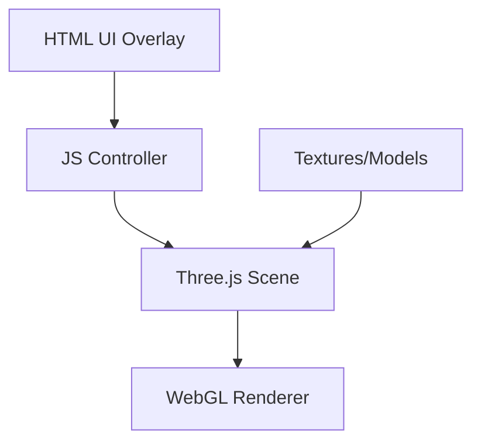

<!-- PRESERVATION RULE: Never delete or replace content. Append or annotate only. -->
# ARCHITECTURE

[AMENDED 2026-06-26]: **Placement bounds & zone UX (`v1.3.0`)**
- **20×20 m build pad** (`innerPlane`, `gridSize`, 1 m grid, 5 m guides) is the primary snap area; **100×100 m outer yard** (`plane`, `SITE_OUTER_HALF`) supports walk + optional placement — **no hard XZ clamp** on ghost/place.
- **Soft zone feedback**: off-pad → amber ghost (`0xffaa44`), readout suffix `yard (off 20×20 pad)`, **`#zone-hud`** Yard chip; overlap blocked still uses red (`0xff3355`).
- **Build boundary ring**: `LineLoop` at ±10 m, y ≈ 0.012; toggle **`#build-zone-ring-btn`**; **`builder3d-build-zone-ring`** in `localStorage` (default on).
- **Ground seam**: `innerPlane` at y ≈ +0.005 above outer floor; **`getGroundYAt`** inner → outer → objects (ghost, measure, FP walk).
- **Stack lock whitelist** (`STACK_LOCK_ITEMS`): `pipe`, `column`, `pex`, `spray` only — blocks/lumber/etc. use grid snap, not vertical stack lock.
- **Paintbrush**: overlap exempt; raycast **placed parts only** (not ground); ghost is aim feedback.
- **Heights**: `ITEM_HEIGHTS` for wedge/stairs/fence/spray/paintbrush; **`snapGhostYToSurface`** for ground-class items + beam/slab flat hits.
- **Clone (`C`)**: ghost position when visible; else face step 1 m or Alt ¼ m.
- **Fence (`N`)**: bearing from last two posts when ≥2 exist; ground Y via **`getGroundYAt`**; side-click chain still via **`trySnapFenceGhost`** on post faces only.
- **FP collision caveat**: AABB vs rotated meshes remains loose — OBB/tighter collision deferred (see **`roadmap.md`** Later).

[AMENDED 2026-05-27]: **AI agents** — read repo root **`AGENTS.md`** before this file; use ARCHITECTURE for system design detail after onboarding.

## System Overview
The app is a single-page vanilla JS application.

## Core Modules
- `main.js`: Entry point, scene initialization, and state management.
- `builder.js`: Logic for placing/modifying 3D items (Currently integrated in main.js).
- `materials.js`: Material definitions, texture loading, and simulation logic (Currently integrated in main.js).

## Environment Setup
- **Outer Plane**: A 100x100 `PlaneGeometry` acting as the global floor.
- **Build Zone**: A 20x20 `PlaneGeometry` slightly raised to prevent Z-fighting, matching the grid area.
- Both planes support dynamic material assignment independently of built objects.
- **[AMENDED 2026-05-21] Site materials (`v1.0.3`)**: `siteGround` tracks `outer` / `inner` material keys; `applyGroundMaterials`, `paintBothGround` (**`H`**), `applyGrassyYardPreset` (**`U`** — grass + dusk lighting). Blueprint **v3** persists `site` via `buildBlueprintPayload()` / `applySiteFromBlueprint`.

## Supported Geometries
- **Boxes**: Blocks, Beams, Slabs, 2x4 Lumber, Wall Plates.
- **Cylinders**: Columns, Pipes, Planter Pots.
- **Torus**: Steel Hooks.
- **[AMENDED 2026-05-21] Fence kit (`v1.0.3`)**: `fence_post` (0.1×1.2×0.1), `fence_rail` (2×0.07×0.07), `fence_panel` (2×0.9×0.04); wood default via `setActiveItem`; `trySnapFenceGhost` (post chain +2 m, rail/panel on post); `placeNextFencePost` (**`N`**).

## Advanced Systems
- **Transformation**: 3-Axis rotation (X, Y, Z) with 90-degree snapping.
- **Persistence**: Snapshot-based save/load with Euler rotation support.
- **Undo/Redo**: Full history stack for all construction actions.

## [AMENDED 2026-04-23]: Runtime structure (single-file app)
- All application logic lives in `main.js` (`BuilderApp`): scene, textures, placement, **undo/redo history** (place / remove / clear operations with serializable mesh snapshots), **blueprint** import/export (JSON `v` + `parts[]`), **takeoff** aggregation, toasts, and keyboard shortcuts.
- UI is `index.html` + `style.css` (sidebar/tools panel, loading overlay, toast host, file input for load).
- Textures load from `assets/textures/*.png` with **canvas fallback** when a file is missing or fails; a **loading overlay** shows until the first texture batch completes.

## [AMENDED 2026-04-23]: First-person view
- Optional **first-person** mode (`fpMode` in `main.js`) disables `OrbitControls` and the placement ghost, saves/restores the orbit camera+target, uses **WASD** + **pointer lock** mouselook, a **raycast** downward from (x, 400, z) for ground/piece tops, and **AABB** (`setFromObject` on parts vs a fixed player height/footprint) to prevent passing through parts.

## [AMENDED 2026-04-23]: First-person — ground, jump, and walkable bounds
- **Ground height** (`getGroundYAt`): vertical ray, targets ordered **`innerPlane`** (20 m build patch, y ≈ +0.005) **→** **`plane`** (100 m floor) **→** **`objects`**. First intersection is the walk surface. Ghost placement and measure mode use the same **inner-then-outer** order so picks match on-foot height.
- **Jump / gravity** (`_fpVelY`, `applyFpVertical`): **Space** to jump; landing handled against ground y + offset. **`applyFpSurfaceSnap`** nudges feet to the raycast ground when truly grounded, and **skips** while the player is moving upward so jumps are not cancelled.
- **“On ground”** (`isFpOnGround`): small vertical tolerance (feet within a few centimetres of the sampled ground) and a velocity gate so mid-air is not misclassified; avoids fighting horizontal movement. **`clampFpToSitePad`**: first-person XZ is **clamped** to the 100 m outer floor (half-size 50, inset by `PLAYER_HW`), defining the **walkable site** on the main pad.
- **Collision note**: AABB–AABB for rotated / diagonal parts can be looser than the visible mesh; tight corners can still feel like blocked space until collision is improved (OBB/physics later).

## [AMENDED 2026-04-23]: Update 1 — site tools (v0.6.0)
- **Measure**: `THREE.Line` between two raycast hits; distance in UI; `innerPlane` / `plane` / parts as targets.
- **Grids**: primary 1 m `GridHelper(20,20)` + optional **major** `GridHelper(20,4)` (~5 m cells); **site readout** shows ghost XYZ.
- **Lighting presets** (`applyLightingPreset`): mutate `AmbientLight`, `DirectionalLight`, `PointLight`, `scene.background`, `Fog`.
- **Ghost overlap**: `Box3.setFromObject(ghost)` vs each part; tint + block place; `meshIntersectsPlaced` for **P** repeat.
- **Levels**: `userData.level` (0–4) on meshes; takeoff TSV includes `level` rows; blueprint `parts[].level`; **Show only this level** toggles `mesh.visible`.
- **Compass / help**: static DOM HUD; modal help panel.

## [AMENDED 2026-05-27]: Sidebar QoL, grids, atmosphere UI (post–`v1.1.0`)
- **Persistence (`localStorage`)**: **`builder3d-sidebar-sections`** (JSON map of `data-section-id` → collapsed); **`builder3d-theme`** (`light` | `dark`); **`builder3d-panel-design`** (`classic` | `pop`); existing **`builder3d-sidebar-collapsed`** / **`builder3d-sidebar-width`** unchanged.
- **Header chrome**: **`#theme-toggle-btn`** → **`applyTheme()`** / **`body.theme-light`** (sidebar CSS variables only); **`#design-toggle-btn`** → **`body.sidebar-design-pop`** (card dropdown styling in `style.css`).
- **Takeoff**: **`updateTakeoff()`** renders `.takeoff-group` blocks; **`#takeoff-expand-all`** / **`#takeoff-collapse-all`**; group toggles via delegated click on **`#takeoff-body`**.
- **Grids**: **`#placement-grid-btn`** ↔ **`gridHelper.visible`** (same as **`G`** / **`toggleGrid()`**); **`#major-grid-btn`** ↔ **`gridMajor`** (`LineSegments` every 5 m on 20×20 m pad, material opacity 0 when off).
- **Sky**: **`createSkyTexture()`** + **`paintSkyCloudStreaks()`**; **`#sky-clouds-toggle`** / **`builder3d-sky-clouds`**; **`refreshSkyBackground()`** on preset or toggle.
- **Startup**: **`setLoading(false)`** → **`beginSidebarEnterAnimation()`** → **`requestAnimationFrame`** → **`tryRestoreDraft()`** (async **`promptRestoreDraft()`** modal, not **`confirm`**) → **`maybeShowReleaseModal()`**. Scene **`animate()`** loop never blocked by draft UI.
- **Layout fix**: `.section-toggle` sticky only under **`.tool-section--primary`**; expanded **`.section-body`** uses **`overflow: visible`** + bottom padding so **`#sun-angle-slider`** is not clipped.

## [AMENDED 2026-05-21]: Tools panel / sidebar (`v1.1.0` UI)
- **Layout**: `#ui-overlay` is a two-column grid — **`--sidebar-slot-width`** (0 when collapsed) + **`viewport-chrome`** (shortcut bar). **`#sidebar`** is a full-viewport-height left dock: header (title, version pill, hint), scrollable **`#toolbar-scroll`** (collapsible `.tool-section`s), footer (**Expand all** / **Collapse all**).
- **Collapse**: `body.sidebar-collapsed` sets slot width to 0; **`#sidebar-expand-tab`** (fixed left) restores. Toggle via **`#sidebar-collapse-btn`**, **`B`**, or `toggleSidebarCollapsed()`; persisted **`builder3d-sidebar-collapsed`**.
- **Resize**: **`#sidebar-resizer`** drag updates CSS **`--sidebar-width`** (clamped 260–480px); persisted **`builder3d-sidebar-width`**; double-click resizer resets default. `body.sidebar-resizing` disables width transition during drag.
- **Tooltips**: `initFastTooltips()` strips native `title` on `#sidebar` controls and shows **`#fast-tooltip`** after ~200ms (positioned to the right of the target).
- **Selection UX**: `setActiveMaterial` / `setActiveItem` call `scrollSidebarToSelection()` and `ensureSidebarSectionVisible()` so keyboard (**`M`**, **`1`–`9`**) and clicks reveal the active tile.
- **Walk / HUD**: First-person crosshair centers on the build area using `--sidebar-slot-width`; stats overlay `left` follows the same variable.

## [AMENDED 2026-04-27]: Update 2.1 — release modal (`v1.0.1`)
- **`APP_RELEASE`** (`main.js`): semantic version + **`dateLabel`** + **`highlights[]`** for **`#update-backdrop`** modal; **`fillReleaseModalDom`** syncs title, date, and list. **`STORAGE_SEEN_RELEASE_KEY`** **`builder3d-seen-release`** compared to **`APP_RELEASE.version`**; **`maybeShowReleaseModal`** runs after **`tryRestoreDraft`** in the post-load timeout. **`openUpdateModalForced`** for toolbar without requiring a version mismatch; **`dismissUpdateModal`** persists seen version and closes.
- **UI**: `#app-version-pill` in header updated with **`APP_RELEASE.version`**; **What’s new** button (`#whats-new-btn`).

## [AMENDED 2026-04-27]: Update 2 — plan view wiring, QoL (`v1.0.0`)
- **Plan / orthographic** (`toggleOrthographic`, `THREE.OrthographicCamera`): toolbar **Plan View** button and **`V`** toggle a top-down ortho camera wired to **`OrbitControls`**; restores prior perspective camera/target and polar-angle limits (`_orthoState`). Walk mode (**`fpMode`**) refuses plan until walk exits; entering walk exits plan first. Resize uses **`onResize()`** to update ortho frustum vs perspective **`aspect`**.
- **`onResize()`**: single handler for window resize (replaces inline perspective-only logic).
- **Compass HUD**: `.compass-hud__inner` **`transform: rotate(-azimuth)`** each frame from **`OrbitControls.getAzimuthalAngle()`** in orbit mode or **`fp.yaw`** in walk mode.
- **Camera**: **`Home`** → `resetOrbitCamera()` (origin target, (10,10,10) eye, exit ortho if needed). **`F`** → `frameAllInView()` (bounding box of `objects[]`; ortho mode adjusts target, camera height, and `orthoSize` frustum).
- **Blueprint clipboard**: `copyBlueprintToClipboard()` — same JSON as file save, via **Clipboard API**; button `#copy-blueprint-btn`.
- **Draft persistence**: `localStorage` key `builder3d-draft`, debounced **`scheduleDraftSave`** after place/remove/clear/import/undo/redo; **[AMENDED 2026-05-27]** **`tryRestoreDraft`** uses **`#draft-restore-backdrop`** (Restore / Start empty) instead of blocking **`window.confirm`**.
- **`Esc` hierarchy**: exit first-person → close help → exit measure (**`keydown`** handler expansion).
- **Delete keys**: **`Delete` / `Backspace`** → `removeObject()` (when not measuring / not walking).
- **Stats overlay** (`#stats-overlay`, **`**` **` backtick)**: FPS + part count; hidden by default.
- **Alt grid snap**: hold **Alt** → `_fineSnap` → ¼ m placement quantization in **`updateGhost`** (non-special cases); **site-readout** suffix shows snap mode (`Alt: ¼ m` vs `1 m grid` vs `PEX surface snap`).
- **`prefers-reduced-motion`**: disables spray particle **`updateParticles`** loop for accessibility.
